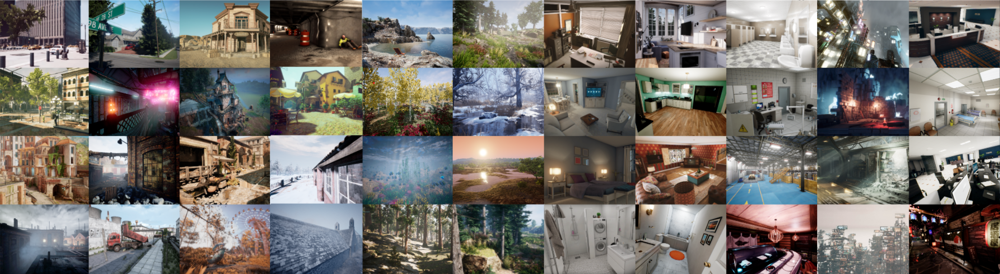
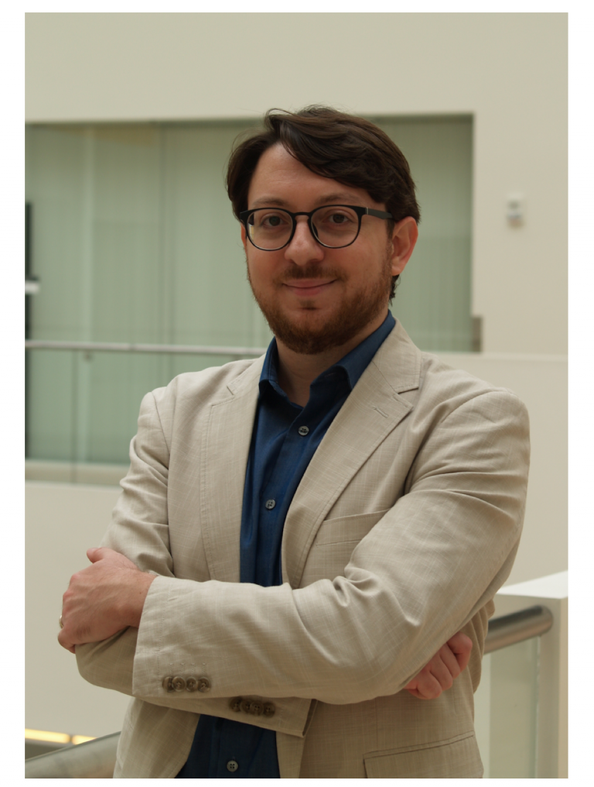
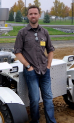
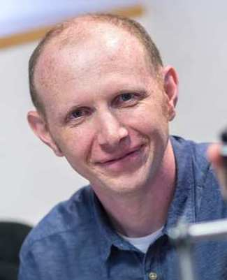
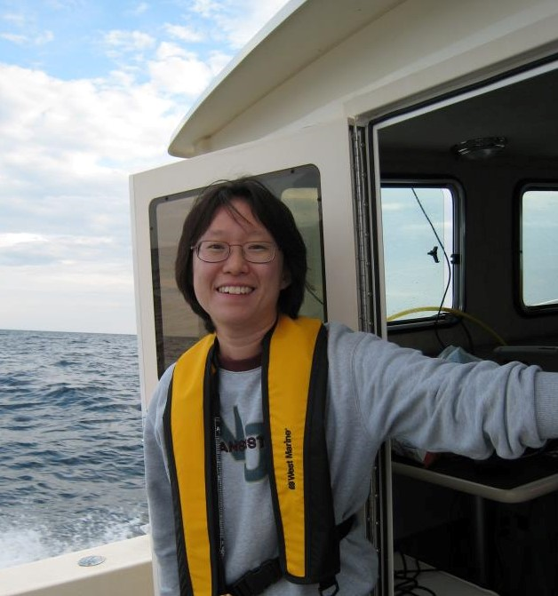
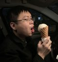
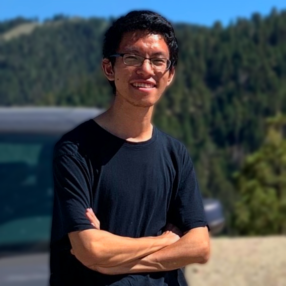
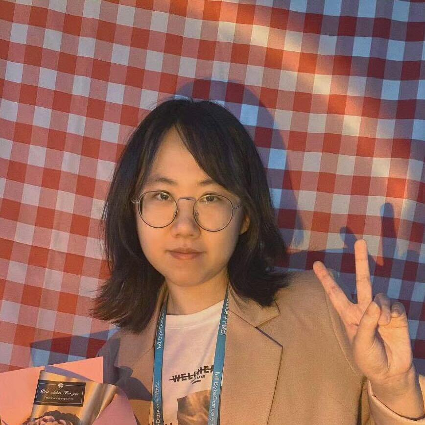

# Announcements

## Outline

This workshop aims to present the latest results on the theory and practice of both traditional
and modern techniques for robot learning, robot perception, and SLAM. A series of contributed and invited talks by academic leaders and renowned researchers will discuss ground-breaking perception and mapping methods for long-term autonomy based on current cutting-edge traditional solutions and modern learning methods. The workshop will also discuss the current challenges and future research directions and will include posters and spotlight talks to facilitate interaction between the speakers and the audience. The workshop plans to have a hybrid format with in-person speakers/attendees and a live broadcast to convey the message to a broader audience. Talk recordings and accepted contributions will be published on the workshop’s webpage to broaden the research impact.

## Impact

**Pushing the generalization ability of robot learning: physics-based optimization v.s. learning-based methods**

Deep learning has had remarkable success in robotic perception, but its data-centric nature suffers when it comes to generalizing to ever-changing environments. By contrast, physics-based optimization generalizes better, especially in robotics, but it does not perform as well in complicated tasks due to the lack of high-level semantic information and reliance on manual parametric tuning. For example, in visual SLAM, supervised learning-based methods showed promising results in the front-end odometry, while non-linear graph optimization plays a vital role in the back-end. Although some efforts have been made to combine learning models with physics-based optimization, we still lack a systematic methodology with unsupervised learning that can bridge the two worlds.

In this workshop, we will invite speakers to discuss the future of the generalization ability of robot learning and the potential direction of the methodology for combing physics-based optimization and learning-based methods. We will cover broad topics in robot planning including learning-based control, planning, visual SLAM, and inertial navigation. We expect that this workshop will inspire a new level of self-learning ability for various autonomous systems, thereby significantly reducing the time, cost, and need for human assistance of diverse missions.

We will also talk about the roles of open-source projects in this direction. The organizers are
engaging in providing efficient and user-friendly open-source libraries, e.g., PyPose to solve the technical challenges of combining deep perceptual models with physics-based optimization. We believe that by organizing a workshop on this topic, we will be able to encourage more researchers and developers to contribute to the entire open-source community. As a result, we will be able to lower the barriers developers face during designing, improve accessibility for workers to learn how to build and execute new tasks, and will be a catalyst for many developers to develop new methods.

This is a direction that previous ICCV workshops seldom cover but is extremely important for the
community. Moreover, since we will also talk about their application specifically in the entire field of robotics, we believe we attract more audience beyond the ICCV community.

**A Challenge to push SLAM Towards All-weather Environments**

Robust odometry system is an indispensable need of autonomous robots operating navigation, exploration, and locomotion in unknown environments. In recent years, various robots are being deployed in increasingly complex environments for a broad spectrum of applications such as off-road driving, search-and-rescue in extreme environments, and robotic rovers on planetary missions. Despite the progress made, most of state estimation algorithms are still vulnerable in long-term operation and still struggle in these scenarios. A key necessity in progressing SLAM for long-term autonomy is the availability of high-quality datasets including various challenging scenerios.

To push the limits of robust SLAM and robust perception, we will organize a SLAM challenge and evaluate the performance from **virtual to real world robotics**. For virtual environments,

Multi Degradation: The dataset contains a broad set of perceptually degraded environments such as darkness, airbone obscurats conditions such as fog, dust, smoke and lack of prominent perceptual features in self-similar areas (Figure2).

- **Multi Robots**: The dataset is collected by various heterogeneous robots including aerial, wheeled and legged robots over multiple seasons. Most importantly, our dataset also provide the extrinsic and communication signal between robots which allows the map could be merged in the single world frame. These features are very important for resarcher to study multi agent SLAM.
- **Multi Spectral**: The dataset also contains different modalities not only visual, LiDAR, and inertial sensors but also the thermal data which is beyond the human eye.
- **Multi Motion**: The existing popular datasets such as KITTI and Cityscapes only covers very limited motion patterns, which are mostly moving straight forward plus small left or right turns. This regular motion is too simple to sufficiently test a visual SLAM algorithm. Our dataset covers much more diverse motion combinations in 3D space, which is significantly more difficult than existing datasets.
- **Multi Dynamic**: Our dataset contains dynamic objects including human, vehicles, dust and snow.
- **Friendly to learning methods**: Our dataset not only provide the benchmark for traditional method but also will provide the benchmark for learning based methods.

The dataset can be used for a number of visual tasks, including optical flow, visual odometry, lidar odometry, thermal odometry and multi agent odometry. Preliminary experiments show that methods performing well on established benchmarks such as KITTI does not achieve satisfactory results on SubT-MRS dataset. In this competition, we will focus on robustness and efficiency. We will provide an evaluation metric (same with the KITTI dataset) and evaluation website for comparison and submission.

## Relationship to previous workshops

It is of great interests in past conferences about the topics of robot learning, navigation and SLAM. There has been many workshops that related to this topic, such as Long-Term Visual Localization under Changing Conditions(**ECCV 2020**), Deep Learning for Visual SLAM (**ICCV 2019**). Most relevant one is the SLAM challenge in **CVPR2020**, which is hosted by one of the organizers,
primarily looking at visual SLAM in challenging environments. This workshop takes a step further to incorporate more modalities, with real-world challenging testing cases. More importantly, this workshop goes beyond visual SLAM and discusses the generalization ability for learning-based robotic methods, which will attract more attention both from CV and robotics communities.

## Schedule

### Session 1 (8:30-10:00 AM)

 <table class="customFormat" style="width:100%border-collapse: collapse; border: none;">
  <tr>
    <b>
    <th style="width:10%;text-align: center;"></th>
    <th style="width:20%;text-align: center;">Presenter</th>
    <th style="width:35%;text-align: center;">Session Title</th>
    <th style="width:15%;text-align: center;">Time</th>
    <th style="width:20%;text-align: center;">YouTube Link</th>
    </b>
  </tr>
  <tr style="height: 100px;">
    <td style="text-align: center; vertical-align: middle;" colspan="3">
        <b style="margin-bottom: 3px;">Welcome message by organizers & overview of workshop</b>
    </td>
    <td style="text-align: center;vertical-align: middle;">
      
8:30 - 8:40 AM

    </td>
    <td align="right;" style="vertical-align: middle;">
      

        

          <iframe style="width:100%;height:100%;position:absolute;" src="coming_soon.html" frameborder="0" allowfullscreen></iframe>
        

      

    </td>  
  </tr>
  <tr>
    <td style="text-align: center;">
      

        
      

    </td>
    <td style="text-align: center;vertical-align: middle;">
      

        <a style="margin-bottom: 1px;" href="https://scholar.harvard.edu/letiziagionfrida/bio">Letizia Gionfrida</a>
      

      
Postdoctoral Research Fellow, Biorobotics Lab

      
Harvard University

    </td>
    <td style="text-align: center;vertical-align: middle;">
      
TDB

    </td>
    <td style="text-align: center;vertical-align: middle;">
      
8:40 - 9:00 AM

    </td>
    <td align="right;" style="vertical-align: middle;">
      

        

          <iframe style="width:100%;height:100%;position:absolute;" src="coming_soon.html" frameborder="0" allowfullscreen></iframe>
        

      

    </td>  
  </tr>
  <tr>
    <td style="text-align: center;">
      

        
      

    </td>
    <td style="text-align: center;vertical-align: middle;">
      

        <a style="margin-bottom: 1px;" href="https://meche.mit.edu/people/faculty/JLEONARD@MIT.EDU">John Leonard</a>
      

      
Professor of Mechanical and Ocean Engineering

      
Massachusetts Institute of Technology

    </td>
    <td style="text-align: center;vertical-align: middle;">
      
TBD

      <!-- <button id="danButton" class="button6" onclick="myFunction('danButton', 'danBlock')">Expand Contents</button> -->
    </td>
    <td style="text-align: center;vertical-align: middle;">
      
9:00 - 9:20 AM

    </td>
    <td align="right;" style="vertical-align: middle;">
      

        

          <iframe style="width:100%;height:100%;position:absolute;" src="coming_soon.html" frameborder="0" allowfullscreen></iframe>
        

      

    </td>  
  </tr>
  <tr>
    <td style="text-align: center;">
      

        
      

    </td>
    <td style="text-align: center;vertical-align: middle;">
      

        <a style="margin-bottom: 1px;" href="https://lucacarlone.mit.edu/">Luca Carlone</a>
      

      
Associate Professor in the Department of Aeronautics and Astronautics

      
Massachusetts Institute of Technology

    </td>
    <td style="text-align: center;vertical-align: middle;">
      
TDB

    </td>
    <td style="text-align: center;vertical-align: middle;">
      
9:20 - 9:40 AM

    </td>
    <td align="right;" style="vertical-align: middle;">
      

        

          <iframe style="width:100%;height:100%;position:absolute;" src="coming_soon.html" frameborder="0" allowfullscreen></iframe>
        

      

    </td>  
  </tr>
  <tr>
    <td style="text-align: center;">  </td>
    <td style="text-align: center;vertical-align: middle;">
      

        <a style="margin-bottom: 1px;" href="https://www.ri.cmu.edu/ri-faculty/sebastian-scherer/">Sebastian Scherer</a>
      

      
Associate Research Professor, Robotics Institute

      
Carnegie Mellon University

    </td>
    <td style="text-align: center;vertical-align: middle;">
      
TBD

      <!-- <button id="bastiButton" class="button6" onclick="myFunction('bastiButton', 'bastiBlock')">Expand Contents</button> -->
      <!-- <a href="#basti" onclick="myFunction('bastiButton', 'bastiBlock')"> Outline and Links</a> -->
    </td>
    <td style="text-align: center;vertical-align: middle;">
      
9:40 - 10:00 AM

    </td>
    <td align="right;" style="vertical-align: middle;">
      

        

          <iframe style="width:100%;height:100%;position:absolute;" src="coming_soon.html" frameborder="0" allowfullscreen></iframe>
        

      

    </td>  
  </tr>
</table>

### Coffee Break and Posters (10:00 - 10:25 AM)

### Sesstion 2 (10:25 AM - 12:00 PM)

<table class="customFormat" style="width:100%border-collapse: collapse; border: none;">
  <tr>
    <b>
    <th style="width:10%;text-align: center;"></th>
    <th style="width:20%;text-align: center;">Presenter</th>
    <th style="width:35%;text-align: center;">Session Title</th>
    <th style="width:15%;text-align: center;">Time</th>
    <th style="width:20%;text-align: center;">YouTube Link</th>
    </b>
  </tr>
  <tr style="height: 100px;">
    <td style="text-align: center; vertical-align: middle;" colspan="3">
        <b style="margin-bottom: 3px;">Spotlight Talk 1</b>
    </td>
    <td style="text-align: center;vertical-align: middle;">
      
10:25 - 10:40 AM

    </td>
    <td align="right;" style="vertical-align: middle;">
      

        

          <iframe style="width:100%;height:100%;position:absolute;" src="coming_soon.html" frameborder="0" allowfullscreen></iframe>
        

      

    </td>  
  </tr>
  <tr>
    <td style="text-align: center;">
      

        
      

    </td>
    <td style="text-align: center;vertical-align: middle;">
      

        <a style="margin-bottom: 1px;" href="http://asrl.utias.utoronto.ca/~tdb/">Tim Barfoot</a>
      

      
Professor

      
University of Toronto

    </td>
    <td style="text-align: center;vertical-align: middle;">
      
TBD

      <!-- <button id="danButton" class="button6" onclick="myFunction('danButton', 'danBlock')">Expand Contents</button> -->
    </td>
    <td style="text-align: center;vertical-align: middle;">
      
10:40 - 11:00 AM

    </td>
    <td align="right;" style="vertical-align: middle;">
      

        

          <iframe style="width:100%;height:100%;position:absolute;" src="coming_soon.html" frameborder="0" allowfullscreen></iframe>
        

      

    </td>  
  </tr>
  <tr>
    <td style="text-align: center;">
      

        
      

    </td>
    <td style="text-align: center;vertical-align: middle;">
      

        <a style="margin-bottom: 1px;" href="https://www.doc.ic.ac.uk/~ajd/">Andrew Davison</a>
      

      
Professor of Robot Vision

      
Imperial College London

    </td>
    <td style="text-align: center;vertical-align: middle;">
      
TBD

      <!-- <button id="danButton" class="button6" onclick="myFunction('danButton', 'danBlock')">Expand Contents</button> -->
    </td>
    <td style="text-align: center;vertical-align: middle;">
      
11:20 - 11:40 AM

    </td>
    <td align="right;" style="vertical-align: middle;">
      

        

          <iframe style="width:100%;height:100%;position:absolute;" src="coming_soon.html" frameborder="0" allowfullscreen></iframe>
        

      

    </td>  
  </tr>
  <tr>
    <td style="text-align: center;">
      

        
      

    </td>
    <td style="text-align: center;vertical-align: middle;">
      

        <a style="margin-bottom: 1px;" href="https://vision.in.tum.de/members/cremers">Daniel Cremers</a>
      

      
Professor of Informatics and Mathematics

      
Technical University of Munich

    </td>
    <td style="text-align: center;vertical-align: middle;">
      
TBD

      <!-- <button id="danButton" class="button6" onclick="myFunction('danButton', 'danBlock')">Expand Contents</button> -->
    </td>
    <td style="text-align: center;vertical-align: middle;">
      
11:20 - 11:40 AM

    </td>
    <td align="right;" style="vertical-align: middle;">
      

        

          <iframe style="width:100%;height:100%;position:absolute;" src="coming_soon.html" frameborder="0" allowfullscreen></iframe>
        

      

    </td>  
  </tr>
  <tr>
    <td style="text-align: center;">
      

        
      

    </td>
    <td style="text-align: center;vertical-align: middle;">
      

        <a style="margin-bottom: 1px;" href="https://people.inf.ethz.ch/pomarc/">Marc Pollefeys</a>
      

      
Full Professor

      
ETH Zurich

    </td>
    <td style="text-align: center;vertical-align: middle;">
      
TBD

      <!-- <button id="danButton" class="button6" onclick="myFunction('danButton', 'danBlock')">Expand Contents</button> -->
    </td>
    <td style="text-align: center;vertical-align: middle;">
      
11:40 - 11:59 AM

    </td>
    <td align="right;" style="vertical-align: middle;">
      

        

          <iframe style="width:100%;height:100%;position:absolute;" src="coming_soon.html" frameborder="0" allowfullscreen></iframe>
        

      

    </td>  
  </tr>

</table>

### Lunck Break and Posters (12:00 - 13:00 PM)

### Session 3 (1:00 - 3:20 PM)

<table class="customFormat" style="width:100%border-collapse: collapse; border: none;">
  <tr>
    <b>
    <th style="width:10%;text-align: center;"></th>
    <th style="width:20%;text-align: center;">Presenter</th>
    <th style="width:35%;text-align: center;">Session Title</th>
    <th style="width:15%;text-align: center;">Time</th>
    <th style="width:20%;text-align: center;">YouTube Link</th>
    </b>
  </tr>
  <tr style="height: 100px;">
    <td style="text-align: center; vertical-align: middle;" colspan="3">
        <b style="margin-bottom: 3px;">SubT-MRS SLAM Challenge Summary</b>
    </td>
    <td style="text-align: center;vertical-align: middle;">
      
1:00 - 1:20 PM

    </td>
    <td align="right;" style="vertical-align: middle;">
      

        

          <iframe style="width:100%;height:100%;position:absolute;" src="coming_soon.html" frameborder="0" allowfullscreen></iframe>
        

      

    </td>  
  </tr>
  <tr style="height: 100px;">
    <td style="text-align: center; vertical-align: middle;" colspan="3">
        <b style="margin-bottom: 3px;">TartanAir Challenge Summary</b>
    </td>
    <td style="text-align: center;vertical-align: middle;">
      
1:20 - 1:40 PM

    </td>
    <td align="right;" style="vertical-align: middle;">
      

        

          <iframe style="width:100%;height:100%;position:absolute;" src="coming_soon.html" frameborder="0" allowfullscreen></iframe>
        

      

    </td>  
  </tr>
  <tr>
    <td style="text-align: center;">
      

        
      

    </td>
    <td style="text-align: center;vertical-align: middle;">
      

        <a style="margin-bottom: 1px;" href="http://shubhtuls.github.io/">Shubham Tulsiani</a>
      

      
Assistant Professor, Robotics Institute

      
Carnegie Mellon University

    </td>
    <td style="text-align: center;vertical-align: middle;">
      
TBD

      <!-- <button id="danButton" class="button6" onclick="myFunction('danButton', 'danBlock')">Expand Contents</button> -->
    </td>
    <td style="text-align: center;vertical-align: middle;">
      
1:40 - 2:00 PM

    </td>
    <td align="right;" style="vertical-align: middle;">
      

        

          <iframe style="width:100%;height:100%;position:absolute;" src="coming_soon.html" frameborder="0" allowfullscreen></iframe>
        

      

    </td>  
  </tr>
  <tr style="height: 100px;">
    <td style="text-align: center; vertical-align: middle;" colspan="3">
        <b style="margin-bottom: 3px;">Spotlight Talk 2</b>
    </td>
    <td style="text-align: center;vertical-align: middle;">
      
2:00 - 2:20 PM

    </td>
    <td align="right;" style="vertical-align: middle;">
      

        

          <iframe style="width:100%;height:100%;position:absolute;" src="coming_soon.html" frameborder="0" allowfullscreen></iframe>
        

      

    </td>  
  </tr>
  <tr>
    <td style="text-align: center;">
      

        
      

    </td>
    <td style="text-align: center;vertical-align: middle;">
      

        <a style="margin-bottom: 1px;" href="https://ayoungk.github.io/">Ayoung Kim</a>
      

      
Associate Professor

      
Seoul National University

    </td>
    <td style="text-align: center;vertical-align: middle;">
      
TBD

      <!-- <button id="danButton" class="button6" onclick="myFunction('danButton', 'danBlock')">Expand Contents</button> -->
    </td>
    <td style="text-align: center;vertical-align: middle;">
      
2:20 - 2:40 PM

    </td>
    <td align="right;" style="vertical-align: middle;">
      

        

          <iframe style="width:100%;height:100%;position:absolute;" src="coming_soon.html" frameborder="0" allowfullscreen></iframe>
        

      

    </td>  
  </tr>
  <tr>
    <td style="text-align: center;">
      

        
      

    </td>
    <td style="text-align: center;vertical-align: middle;">
      

        <a style="margin-bottom: 1px;" href="https://www.cs.cmu.edu/~kaess/">Michael Kaess</a>
      

      
Associate Professor in Robotics Institute

      
Carnegie Mellon University

    </td>
    <td style="text-align: center;vertical-align: middle;">
      
TBD

      <!-- <button id="danButton" class="button6" onclick="myFunction('danButton', 'danBlock')">Expand Contents</button> -->
    </td>
    <td style="text-align: center;vertical-align: middle;">
      
2:40 - 2:55 PM

    </td>
    <td align="right;" style="vertical-align: middle;">
      

        

          <iframe style="width:100%;height:100%;position:absolute;" src="coming_soon.html" frameborder="0" allowfullscreen></iframe>
        

      

    </td>  
  </tr>
  <tr>
    <td style="text-align: center;">
      

        
      

    </td>
    <td style="text-align: center;vertical-align: middle;">
      

        <a style="margin-bottom: 1px;" href="https://engineering.buffalo.edu/computer-science-engineering/people/faculty-directory/full-time.host.html/content/shared/engineering/computer-science-engineering/profiles/faculty/ladder/wang-chen.html">Chen Wang</a>
      

      
Assistant Professor in Department of Computer Science and Engineering

      
University of Buffalo

    </td>
    <td style="text-align: center;vertical-align: middle;">
      
TBD

      <!-- <button id="danButton" class="button6" onclick="myFunction('danButton', 'danBlock')">Expand Contents</button> -->
    </td>
    <td style="text-align: center;vertical-align: middle;">
      
2:55 - 3:10 PM

    </td>
    <td align="right;" style="vertical-align: middle;">
      

        

          <iframe style="width:100%;height:100%;position:absolute;" src="coming_soon.html" frameborder="0" allowfullscreen></iframe>
        

      

    </td>  
  </tr>
  <tr style="height: 100px;">
    <td style="text-align: center; vertical-align: middle;" colspan="3">
        <b style="margin-bottom: 3px;">Concluding Remarks</b>
    </td>
    <td style="text-align: center;vertical-align: middle;">
      
3:10 - 3:20 PM

    </td>
    <td align="right;" style="vertical-align: middle;">
      

        

          <iframe style="width:100%;height:100%;position:absolute;" src="coming_soon.html" frameborder="0" allowfullscreen></iframe>
        

      

    </td>  
  </tr>
</table>

## Competition

The workshop has an associated new benchmark dataset (Subt-MRS datasets and TartanAir V2 datasets) that we will publish three months before the workshop.

### 01/June - 01/July Release Datasets Stage:

- _Release the SubT-MRS Datasets and TartanAir V2 Datasets_

### 01/July - 30/Sep Competition Start

- _Organize Competition and Submission Results_

### 01/Oct - 02/Oct Competition End

- 9:00 - 9:30 AM: Subt-MRS SLAM Challenge Summary
- 9:30 - 10:00 AM: TartanAir V2 SLAM Challenge Summary

## Diversity

The organizing committee has taken a proactive approach to diversity by actively seeking out individuals from underrepresented groups, including women, people of color, to join our team. Our organizing committee is a diverse group of individuals from both academia and industry, bringing a unique blend of perspectives and expertise to the workshop. We believe that a diverse committee will bring fresh ideas and approaches to the workshop, and will help to create a more inclusive and welcoming environment for all attendees.

In addition to our efforts to promote diversity among the organizing committee, we have also made a conscious effort to ensure that our invited speakers reflect the diversity of the computer vision community. Our invited speakers hail from different universities across North America, Europe, and Asia, bringing a wide range of perspectives and experiences to the workshop. We believe that this diverse representation of speakers will provide a rich and stimulating environment for attendees to learn and engage with one another.

## Format

We will hold a **hybrid** workshop with in-person speakers/attendees and a live broadcast over Zoom to allow people who are unable to travel to the conference to be able to participate. We will record highquality videos of the talks using a professional camera and a dedicated microphone for the speakers. These recordings will be published on the workshop’s webpage after the event.

The workshop will consist of three main sessions with coffee/lunch breaks in between. Each session
will include **15-minute** talks by invited speakers interleaved with **5-minute** questions/discussions. The discussions will be based on questions solicited from the audience and session chair during the event. We will employ online audience engagement tools (such as Zoom or https://www.sli.do) for collecting questions and observations from the attendants to be addressed by the invited speakers. The schedule further includes two spotlight talks for top selected contributions. Each spotlight session will consist of a **15-minute** oral presentation by authors of the selected work.

## Organizers & Committee

 <table class="customFormat" style="width:100%border-collapse: collapse; border: none;">
  <tr>
    <td style="text-align: center;">
      
      

        <a style="margin-bottom: 1px;" href="https://sairlab.org/team/chen/">Chen Wang</a>
      

      
Assistant Professor, Spatial AI & Robotics Lab

      
University at Buffalo

    </td>
    <td style="text-align: center;">
      
      

        <a style="margin-bottom: 1px;" href="https://scholar.google.com/citations?user=aEK45mEAAAAJ">Yuheng Qiu</a>
      

      
PhD Candidate

      
Carnegie Mellon University

    </td>
    <td style="text-align: center;">
      
      

        <a style="margin-bottom: 1px;" href="http://www.wangwenshan.com/">Wenshan Wang</a>
      

      
Project Scientist, Robotics Institute

      
Carnegie Mellon University

    </td>
    <td style="text-align: center;">
      
      

        <a style="margin-bottom: 1px;" href="https://theairlab.org/team/sebastian/">Sebastian Scherer</a>
      

      
Research Associate Professor, Robotics Institute 

      
Carnegie Mellon University

    </td>
  </tr>
  <tr>
   <td style="text-align: center;">
      
      

        <a style="margin-bottom: 1px;" href="https://theairlab.org/team/shiboz/">Shibo Zhao</a>
      

      
PhD Candidate 

      
Carnegie Mellon University

    </td>
    <td style="text-align: center;">
      
      

        <a style="margin-bottom: 1px;" href="https://scholar.harvard.edu/letiziagionfrida/bio">Letizia Gionfrida</a>
      

      
Postdoctoral Research Fellow, Biorobotics Lab

      
Harvard University

    </td>
    <td style="text-align: center;">
      
      

        <a style="margin-bottom: 1px;" href="https://ayoungk.github.io/">Ayoung Kim</a>
      

      
Robust Perception and Mobile Robotics Lab

      
Seoul National University

    </td>
    <td style="text-align: center;">
      
      

        <a style="margin-bottom: 1px;" href="https://www.shuangma.me/">Shuang Ma</a>
      

      
Senior researcher,  Autonomous Systems Research Team

      
Microsoft

    </td> 
  </tr>
  <tr>
   <td style="text-align: center;">
      
      

        <a style="margin-bottom: 1px;" href="https://sairlab.org/team/shaoshu/">Shaoshu Shu</a>
      

      
PhD Candidate 

      
University at Buffalo

    </td>
    <td style="text-align: center;">
      
      

        <a style="margin-bottom: 1px;" href="https://sairlab.org/team/yidu/">Yi Du</a>
      

      
Ph.D. student, Spatial AI & Robotics Lab

      
University at Buffalo

    </td> 
    <td style="text-align: center;">
      
      

        <a style="margin-bottom: 1px;" href="https://drive.google.com/file/d/1qWiMQoJsAF4oOikU0akjOOveBn-SUOLl/view">Rushan Jiang</a>
      

      
Undergradate Student

      
Carnegie Mellon University

    </td>
    <td style="text-align: center;">
      
      

        <a style="margin-bottom: 1px;" href="https://seansun.org">Haoxiang Sun</a>
      

      
Undergradate Student

      
Carnegie Mellon University

    </td>
  </tr>
  <tr>
   <td style="text-align: center;">
      
      

        <a style="margin-bottom: 1px;" href="https://www.ri.cmu.edu/ri-people/yao-he/">Yao He</a>
      

      
Research Associate

      
Carnegie Mellon University

    </td>
    <td style="text-align: center;">
      
      

        <a style="margin-bottom: 1px;" href="https://www.linkedin.com/mwlite/in/tianhao-wu-112688a6">Tian Hao Wu</a>
      

      
Research Associate

      
Carnegie Mellon University

    </td> 
    <!-- <td style="text-align: center;">
      
      

        <a style="margin-bottom: 1px;" href="https://drive.google.com/file/d/1qWiMQoJsAF4oOikU0akjOOveBn-SUOLl/view">Rushan Jiang</a>
      

      
Undergradate Student

      
Carnegie Mellon University

    </td> -->
    <!-- <td style="text-align: center;">
      
      

        <a style="margin-bottom: 1px;" href="https://seansun.org">Haoxiang Sun</a>
      

      
Undergradate Student

      
Carnegie Mellon University

    </td>
    <td style="text-align: center;">
      
      

        <a style="margin-bottom: 1px;" href="https://seansun.org">Haoxiang Sun</a>
      

      
Undergradate Student

      
Carnegie Mellon University

    </td> -->
  </tr>
</table>

## Calendar

<iframe src="https://calendar.google.com/calendar/embed?src=fvmu1rsn897tkj0qiqjcujis2c%40group.calendar.google.com&ctz=America%2FNew_York" style="border: 0" width="800" height="600" frameborder="0" scrolling="no"></iframe>

