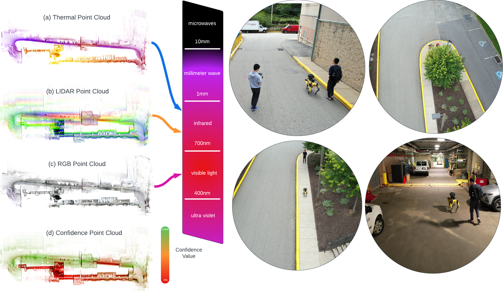

|  |  |

# Announcements
- **Outcome:**: The workshop had the highest number of registrants among all ICRA workshops/tutorials. We are grateful to all who participated.
- **Speaker slides:** Slides can be downloaded from this [page](#TODO) 
- **High registration:** The workshop now has 1170 registrants (608 in-person, 562 virtual). We are excited and look forward to seeing you!
- **Live broadcast:** The workshop Zoom link is available at https://events.infovaya.com/session?id=14353. To access the link, you need to register for ICRA (virtual access is free) and create an account on Infovaya.
- **Contributions:** Accepted submissions are posted and are available for download.
- **Posters:** While optional, we encourage authors of accepted papers to prepare a poster of their work. Posters will be displayed in a central hallway on poster boards - boards will be provided. Authors are responsible for printing their posters. Each poster should fit within a 4 foot x 4 foot space.
- **High number of submissions:** We received 48 paper submissions. We are grateful to all researchers who contributed to the workshop.

<!-- 

 
    <iframe width="100%" height="400" style="display: block; margin-left: auto; margin-right: auto; width: 50%;"  src="https://www.youtube.com/embed/YN1T4mQgWmY" title="Website - Sensor Video" frameborder="0" allow="accelerometer; autoplay; clipboard-write; encrypted-media; gyroscope; picture-in-picture" allowfullscreen></iframe>

 -->

## Outline
This workshop aims to present the latest results on the theory and practice of learning and algorithmic techniques for robotic perception and mapping. A series of contributed and invited talks by academic leaders and renowned researchers will discuss ground-breaking perception and mapping methods based on optimization and filtering, learning and data-driven models, uncertainty-aware and certifiable perception, multi-agent and distributed mapping, semantic representation, and mesh-based compression. The workshop will also discuss the current challenges and research directions in the next 5-10 years, and will include posters and spotlight talks to facilitate interaction between the speakers and the audience. The workshop plans to have a hybrid format with in-person speakers/attendees and a live broadcast to convey the message to a broader audience. Talk recordings and accepted contributions will be published on the workshop's webpage to broaden the research impact.

***EXPECTED OUTCOME:***
By facilitating discussion among participants, authors of contributed papers, and invited speakers, the workshop aims to study and answer the following fundamental questions:

1) What are the latest results and emerging research directions for algorithmic perception and mapping (such as optimization and graph-theoretic techniques)?

2) What are the latest results and emerging research directions for end-to-end and data-driven robotic perception and mapping?

3) How can existing solutions be used in multi-robot and distributed settings with asynchronous and/or incremental data?

4) How to utilize these methods in real-time systems with limited computational resources or in distributed systems with limited communication capacity and what are the trade-offs?

5) What are the correct notions, quantifications, and measures of accuracy for perception and mapping?

6) How is "failure" defined in perception and mapping and what is the consequence of failure in downstream applications?

## Schedule
 <table class="customFormat" style="width:100%border-collapse: collapse; border: none;">
  <tr>
    <b>
    <th style="width:10%;text-align: center;"></th>
    <th style="width:20%;text-align: center;"><b>Presenter</b></th>
    <th style="width:35%;text-align: center;">Session Title</th>
    <th style="width:15%;text-align: center;">Date/Time</th>
    <th style="width:20%;text-align: center;">YouTube Link</th>
    </b>
  </tr>
  <tr>
    <td style="text-align: center;">  </td>
    <td style="text-align: center;vertical-align: middle;">
      

        <a style="margin-bottom: 1px;" href="https://www.ri.cmu.edu/ri-faculty/sebastian-scherer/">Sebastian Scherer</a>
      

      
Associate Research Professor, Robotics Institute

      
Georgia Tech

    </td>
    <td style="text-align: center;vertical-align: middle;">
      
TBD

      <!-- <button id="bastiButton" class="button6" onclick="myFunction('bastiButton', 'bastiBlock')">Expand Contents</button> -->
      <!-- <a href="#basti" onclick="myFunction('bastiButton', 'bastiBlock')"> Outline and Links</a> -->
    </td>
    <td style="text-align: center;vertical-align: middle;">
      
Date: TBD

      
Time: TBD

    </td>
    <td align="right;" style="vertical-align: middle;">
      

        

          <iframe style="width:100%;height:100%;position:absolute;" src="TODO" frameborder="0" allowfullscreen></iframe>
        

      

    </td>  
  </tr>

  <tr id=bastiBlock style="display: none">
    <td colspan="5" style="vertical-align: middle;margin-left: 20px;">
      
 Outline:

      <ul>
        <li>Overview of SLAM</li>
        <li>Learning-based methods for SLAM</li>
        <li>How do we handle the hard cases in SLAM? What are the challenges ahead?</li>
        <li>Bridging the gap between dataset validation and real-world system deployment</li>
      </ul>
      <a style="margin-bottom: 1px;" href="https://docs.google.com/presentation/d/1wW2BfEC7n0d78aajhLq-OBG1DQG0mATwpwwYFvwQ04g/edit?usp=sharing">Slides for the talk including resources to get started with SLAM</a>
    </td>
  </tr>
  <tr>
    <td style="text-align: center;">
      

        
      

    </td>
    <td style="text-align: center;vertical-align: middle;">
      

        <a style="margin-bottom: 1px;" href="https://lucacarlone.mit.edu/">Luca Carlone</a>
      

      
Associate Professor in the Department of Aeronautics and Astronautics

      
Massachusetts Institute of Technology

    </td>
    <td style="text-align: center;vertical-align: middle;">
      
TDB

    </td>
    <td style="text-align: center;vertical-align: middle;">
      
Date: TBD

      
Time: TBD

    </td>
    <td align="right;" style="vertical-align: middle;">
      

        

          <iframe style="width:100%;height:100%;position:absolute;" src="TODO" frameborder="0" allowfullscreen></iframe>
        

      

    </td>  
  </tr>
  <tr>
    <td style="text-align: center;">
      

        
      

    </td>
    <td style="text-align: center;vertical-align: middle;">
      

        <a style="margin-bottom: 1px;" href="https://engineering.buffalo.edu/computer-science-engineering/people/faculty-directory/full-time.host.html/content/shared/engineering/computer-science-engineering/profiles/faculty/ladder/wang-chen.html">Chen Wang</a>
      

      
Assistant Professor in Department of Computer Science and Engineering

      
University of Buffalo

    </td>
    <td style="text-align: center;vertical-align: middle;">
      
TBD

      <!-- <button id="danButton" class="button6" onclick="myFunction('danButton', 'danBlock')">Expand Contents</button> -->
    </td>
    <td style="text-align: center;vertical-align: middle;">
      
TBD

      
TBD

    </td>
    <td align="right;" style="vertical-align: middle;">
      

        

          <iframe style="width:100%;height:100%;position:absolute;" src="TODO" frameborder="0" allowfullscreen></iframe>
        

      

    </td>  
  </tr>
  <tr>
    <td style="text-align: center;">
      

        
      

    </td>
    <td style="text-align: center;vertical-align: middle;">
      

        <a style="margin-bottom: 1px;" href="https://www.cc.gatech.edu/people/frank-dellaert">Frank Dellaert</a>
      

      
Professor

      
Georgia Tech

    </td>
    <td style="text-align: center;vertical-align: middle;">
      
TBD

      <!-- <button id="danButton" class="button6" onclick="myFunction('danButton', 'danBlock')">Expand Contents</button> -->
    </td>
    <td style="text-align: center;vertical-align: middle;">
      
TBD

      
TBD

    </td>
    <td align="right;" style="vertical-align: middle;">
      

        

          <iframe style="width:100%;height:100%;position:absolute;" src="TODO" frameborder="0" allowfullscreen></iframe>
        

      

    </td>  
  </tr>
  <tr>
    <td style="text-align: center;">
      

        
      

    </td>
    <td style="text-align: center;vertical-align: middle;">
      

        <a style="margin-bottom: 1px;" href="http://www.cs.cmu.edu/~hebert/">Martial Hebert</a>
      

      
Professor, Robotics Institute

      
Carnegie Mellon University

    </td>
    <td style="text-align: center;vertical-align: middle;">
      
TBD

      <!-- <button id="danButton" class="button6" onclick="myFunction('danButton', 'danBlock')">Expand Contents</button> -->
    </td>
    <td style="text-align: center;vertical-align: middle;">
      
TBD

      
TBD

    </td>
    <td align="right;" style="vertical-align: middle;">
      

        

          <iframe style="width:100%;height:100%;position:absolute;" src="TODO" frameborder="0" allowfullscreen></iframe>
        

      

    </td>  
  </tr>
  <tr>
    <td style="text-align: center;">
      

        
      

    </td>
    <td style="text-align: center;vertical-align: middle;">
      

        <a style="margin-bottom: 1px;" href="https://www.cs.cmu.edu/~kaess/">Michael Kaess</a>
      

      
Associate Professor, Robotics Institute

      
Carnegie Mellon University

    </td>
    <td style="text-align: center;vertical-align: middle;">
      
TBD

      <!-- <button id="stevenButton" class="button6" onclick="myFunction('stevenButton', 'stevenBlock')">Expand Contents</button> -->
    </td>
    <td style="text-align: center;vertical-align: middle;">
      
TBD

      
TBD

    </td>
    <td align="right;" style="vertical-align: middle;">
      

        

          <iframe style="width:100%;height:100%;position:absolute;" src="TODO" frameborder="0" allowfullscreen></iframe>
        

      

    </td>  
  </tr>
  <tr id=stevenBlock style="display: none">
    <td colspan="5" style="vertical-align: middle;margin-left: 20px;">
      
<strong>Abstract: </strong>

      
Gimbal-stabilized dynamic cameras provide many advantages in robotic applications governed by highly dynamic motion profiles and uneven feature distributions, due to their ability to provide smooth image capture independent of robot motion. In order to integrate information received from  gimballed cameras, an accurate time-varying extrinsic calibration between the dynamic camera and other sensors, such as static cameras and IMUs, needs to be determined. In this talk, I will first present our work on the extrinsic calibration for dynamic and static camera clusters. I will then talk about our recent efforts to perform the calibration between a dynamic camera and an IMU, online and in flight while presenting results in simulation and real hardware data.

    </td>
  </tr>
  <tr>
    <td style="text-align: center;">
      

        
      

    </td>
    <td style="text-align: center;vertical-align: middle;">
      

        <a style="margin-bottom: 1px;" href="https://www.ipb.uni-bonn.de/people/cyrill-stachniss/">Cyrill Stachniss</a>
      

      
Professor

      
University of Bonn

    </td>
    <td style="text-align: center;vertical-align: middle;">
      
TBD

      <!-- <button id="danButton" class="button6" onclick="myFunction('danButton', 'danBlock')">Expand Contents</button> -->
    </td>
    <td style="text-align: center;vertical-align: middle;">
      
TBD

      
TBD

    </td>
    <td align="right;" style="vertical-align: middle;">
      

        

          <iframe style="width:100%;height:100%;position:absolute;" src="TODO" frameborder="0" allowfullscreen></iframe>
        

      

    </td>  
  </tr>
  <tr>
    <td style="text-align: center;">
      

        
      

    </td>
    <td style="text-align: center;vertical-align: middle;">
      

        <a style="margin-bottom: 1px;" href="https://aliagha.site/">Ali Agha</a>
      

      
Principal Investigator and Research Technologist

      
NASA JPL

    </td>
    <td style="text-align: center;vertical-align: middle;">
      
TBD

      <!-- <button id="danButton" class="button6" onclick="myFunction('danButton', 'danBlock')">Expand Contents</button> -->
    </td>
    <td style="text-align: center;vertical-align: middle;">
      
TBD

      
TBD

    </td>
    <td align="right;" style="vertical-align: middle;">
      

        

          <iframe style="width:100%;height:100%;position:absolute;" src="TODO" frameborder="0" allowfullscreen></iframe>
        

      

    </td>  
  </tr>
  <tr>
    <td style="text-align: center;">
      

        
      

    </td>
    <td style="text-align: center;vertical-align: middle;">
      

        <a style="margin-bottom: 1px;" href="http://www2.informatik.uni-freiburg.de/~burgard/">Wolfram Burgard</a>
      

      
Professor for Computer Science

      
University of Freiburg

    </td>
    <td style="text-align: center;vertical-align: middle;">
      
TBD

      <!-- <button id="danButton" class="button6" onclick="myFunction('danButton', 'danBlock')">Expand Contents</button> -->
    </td>
    <td style="text-align: center;vertical-align: middle;">
      
TBD

      
TBD

    </td>
    <td align="right;" style="vertical-align: middle;">
      

        

          <iframe style="width:100%;height:100%;position:absolute;" src="TODO" frameborder="0" allowfullscreen></iframe>
        

      

    </td>  
  </tr>
  <tr>
    <td style="text-align: center;">
      

        
      

    </td>
    <td style="text-align: center;vertical-align: middle;">
      

        <a style="margin-bottom: 1px;" href="https://meche.mit.edu/people/faculty/JLEONARD@MIT.EDU">John Leonard</a>
      

      
Professor of Mechanical and Ocean Engineering

      
Massachusetts Institute of Technology

    </td>
    <td style="text-align: center;vertical-align: middle;">
      
TBD

      <!-- <button id="danButton" class="button6" onclick="myFunction('danButton', 'danBlock')">Expand Contents</button> -->
    </td>
    <td style="text-align: center;vertical-align: middle;">
      
TBD

      
TBD

    </td>
    <td align="right;" style="vertical-align: middle;">
      

        

          <iframe style="width:100%;height:100%;position:absolute;" src="TODO" frameborder="0" allowfullscreen></iframe>
        

      

    </td>  
  </tr>
  <tr>
    <td style="text-align: center;">
      

        
      

    </td>
    <td style="text-align: center;vertical-align: middle;">
      

        <a style="margin-bottom: 1px;" href="https://www.cs.cmu.edu/~deva/">Deva Ramanan</a>
      

      
Professor, Robotics Institute

      
Carnegie Mellon University

    </td>
    <td style="text-align: center;vertical-align: middle;">
      
TBD

      <!-- <button id="danButton" class="button6" onclick="myFunction('danButton', 'danBlock')">Expand Contents</button> -->
    </td>
    <td style="text-align: center;vertical-align: middle;">
      
TBD

      
TBD

    </td>
    <td align="right;" style="vertical-align: middle;">
      

        

          <iframe style="width:100%;height:100%;position:absolute;" src="TODO" frameborder="0" allowfullscreen></iframe>
        

      

    </td>  
  </tr>
  <tr>
    <td style="text-align: center;">
      

        
      

    </td>
    <td style="text-align: center;vertical-align: middle;">
      

        <a style="margin-bottom: 1px;" href="https://homes.cs.washington.edu/~fox/">Dieter Fox</a>
      

      
Professor in the Allen School of Computer Science & Engineering

      
University of Washington

    </td>
    <td style="text-align: center;vertical-align: middle;">
      
TBD

      <!-- <button id="danButton" class="button6" onclick="myFunction('danButton', 'danBlock')">Expand Contents</button> -->
    </td>
    <td style="text-align: center;vertical-align: middle;">
      
TBD

      
TBD

    </td>
    <td align="right;" style="vertical-align: middle;">
      

        

          <iframe style="width:100%;height:100%;position:absolute;" src="TODO" frameborder="0" allowfullscreen></iframe>
        

      

    </td>  
  </tr>
  <tr>
    <td style="text-align: center;">
      

        
      

    </td>
    <td style="text-align: center;vertical-align: middle;">
      

        <a style="margin-bottom: 1px;" href="http://asrl.utias.utoronto.ca/~tdb/">Tim Barfoot</a>
      

      
Professor

      
University of Toronto

    </td>
    <td style="text-align: center;vertical-align: middle;">
      
TBD

      <!-- <button id="danButton" class="button6" onclick="myFunction('danButton', 'danBlock')">Expand Contents</button> -->
    </td>
    <td style="text-align: center;vertical-align: middle;">
      
TBD

      
TBD

    </td>
    <td align="right;" style="vertical-align: middle;">
      

        

          <iframe style="width:100%;height:100%;position:absolute;" src="TODO" frameborder="0" allowfullscreen></iframe>
        

      

    </td>  
  </tr>
  <tr>
    <td style="text-align: center;">
      

        
      

    </td>
    <td style="text-align: center;vertical-align: middle;">
      

        <a style="margin-bottom: 1px;" href="https://rsl.ethz.ch/the-lab/people/person-detail.MTIxOTEx.TGlzdC8yNDQxLC0xNDI1MTk1NzM1.html">Marco Hutter</a>
      

      
Professor

      
ETH Zurich

    </td>
    <td style="text-align: center;vertical-align: middle;">
      
TBD

      <!-- <button id="danButton" class="button6" onclick="myFunction('danButton', 'danBlock')">Expand Contents</button> -->
    </td>
    <td style="text-align: center;vertical-align: middle;">
      
TBD

      
TBD

    </td>
    <td align="right;" style="vertical-align: middle;">
      

        

          <iframe style="width:100%;height:100%;position:absolute;" src="TODO" frameborder="0" allowfullscreen></iframe>
        

      

    </td>  
  </tr>
  <tr>
    <td style="text-align: center;">
      

        
      

    </td>
    <td style="text-align: center;vertical-align: middle;">
      

        <a style="margin-bottom: 1px;" href="https://www.doc.ic.ac.uk/~ajd/">Andrew Davison</a>
      

      
Professor of Robot Vision

      
Imperial College London

    </td>
    <td style="text-align: center;vertical-align: middle;">
      
TBD

      <!-- <button id="danButton" class="button6" onclick="myFunction('danButton', 'danBlock')">Expand Contents</button> -->
    </td>
    <td style="text-align: center;vertical-align: middle;">
      
TBD

      
TBD

    </td>
    <td align="right;" style="vertical-align: middle;">
      

        

          <iframe style="width:100%;height:100%;position:absolute;" src="TODO" frameborder="0" allowfullscreen></iframe>
        

      

    </td>  
  </tr>
  <tr>
    <td style="text-align: center;">
      

        
      

    </td>
    <td style="text-align: center;vertical-align: middle;">
      

        <a style="margin-bottom: 1px;" href="https://vision.in.tum.de/members/cremers">Daniel Cremers</a>
      

      
Professor of Informatics and Mathematics

      
Technical University of Munich

    </td>
    <td style="text-align: center;vertical-align: middle;">
      
TBD

      <!-- <button id="danButton" class="button6" onclick="myFunction('danButton', 'danBlock')">Expand Contents</button> -->
    </td>
    <td style="text-align: center;vertical-align: middle;">
      
TBD

      
TBD

    </td>
    <td align="right;" style="vertical-align: middle;">
      

        

          <iframe style="width:100%;height:100%;position:absolute;" src="TODO" frameborder="0" allowfullscreen></iframe>
        

      

    </td>  
  </tr>
  <tr>
    <td style="text-align: center;">
      

        
      

    </td>
    <td style="text-align: center;vertical-align: middle;">
      

        <a style="margin-bottom: 1px;" href="https://people.inf.ethz.ch/pomarc/">Marc Pollefeys</a>
      

      
Full Professor

      
ETH Zurich

    </td>
    <td style="text-align: center;vertical-align: middle;">
      
TBD

      <!-- <button id="danButton" class="button6" onclick="myFunction('danButton', 'danBlock')">Expand Contents</button> -->
    </td>
    <td style="text-align: center;vertical-align: middle;">
      
TBD

      
TBD

    </td>
    <td align="right;" style="vertical-align: middle;">
      

        

          <iframe style="width:100%;height:100%;position:absolute;" src="TODO" frameborder="0" allowfullscreen></iframe>
        

      

    </td>  
  </tr>
  <tr>
    <td style="text-align: center;">
      

        
      

    </td>
    <td style="text-align: center;vertical-align: middle;">
      

        <a style="margin-bottom: 1px;" href="https://scholar.google.com/citations?user=MDIyLnwAAAAJ&hl=en">Roland Siegwart</a>
      

      
Professor of Robotics

      
ETH Zurich

    </td>
    <td style="text-align: center;vertical-align: middle;">
      
TBD

      <!-- <button id="danButton" class="button6" onclick="myFunction('danButton', 'danBlock')">Expand Contents</button> -->
    </td>
    <td style="text-align: center;vertical-align: middle;">
      
TBD

      
TBD

    </td>
    <td align="right;" style="vertical-align: middle;">
      

        

          <iframe style="width:100%;height:100%;position:absolute;" src="TODO" frameborder="0" allowfullscreen></iframe>
        

      

    </td>  
  </tr>
  <tr>
    <td style="text-align: center;">
      

        
      

    </td>
    <td style="text-align: center;vertical-align: middle;">
      

        <a style="margin-bottom: 1px;" href="http://shubhtuls.github.io/">Shubham Tulsiani</a>
      

      
Assistant Professor, Robotics Institute

      
Carnegie Mellon University

    </td>
    <td style="text-align: center;vertical-align: middle;">
      
TBD

      <!-- <button id="danButton" class="button6" onclick="myFunction('danButton', 'danBlock')">Expand Contents</button> -->
    </td>
    <td style="text-align: center;vertical-align: middle;">
      
TBD

      
TBD

    </td>
    <td align="right;" style="vertical-align: middle;">
      

        

          <iframe style="width:100%;height:100%;position:absolute;" src="TODO" frameborder="0" allowfullscreen></iframe>
        

      

    </td>  
  </tr>
  <tr>
    <td style="text-align: center;">
      

        
      

    </td>
    <td style="text-align: center;vertical-align: middle;">
      

        <a style="margin-bottom: 1px;" href="https://ayoungk.github.io/">Ayoung Kim</a>
      

      
Associate Professor

      
Seoul National University

    </td>
    <td style="text-align: center;vertical-align: middle;">
      
TBD

      <!-- <button id="danButton" class="button6" onclick="myFunction('danButton', 'danBlock')">Expand Contents</button> -->
    </td>
    <td style="text-align: center;vertical-align: middle;">
      
TBD

      
TBD

    </td>
    <td align="right;" style="vertical-align: middle;">
      

        

          <iframe style="width:100%;height:100%;position:absolute;" src="TODO" frameborder="0" allowfullscreen></iframe>
        

      

    </td>  
  </tr>
  <tr>
    <td style="text-align: center;">
      

        
      

    </td>
    <td style="text-align: center;vertical-align: middle;">
      

        <a style="margin-bottom: 1px;" href="https://scholar.google.com/citations?user=x3EW4bkAAAAJ&hl=en">Jongwoo Lim</a>
      

      
Assistant Professor

      
Seoul National University

    </td>
    <td style="text-align: center;vertical-align: middle;">
      
TBD

      <!-- <button id="danButton" class="button6" onclick="myFunction('danButton', 'danBlock')">Expand Contents</button> -->
    </td>
    <td style="text-align: center;vertical-align: middle;">
      
TBD

      
TBD

    </td>
    <td align="right;" style="vertical-align: middle;">
      

        

          <iframe style="width:100%;height:100%;position:absolute;" src="TODO" frameborder="0" allowfullscreen></iframe>
        

      

    </td>  
  </tr>
  <tr>
    <td style="text-align: center;">
      

        
      

    </td>
    <td style="text-align: center;vertical-align: middle;">
      

        <a style="margin-bottom: 1px;" href="https://uav.hkust.edu.hk/group/">Shaojie Shen</a>
      

      
Associate Professor

      
Hong Kong University of Science and Technology

    </td>
    <td style="text-align: center;vertical-align: middle;">
      
TBD

      <!-- <button id="danButton" class="button6" onclick="myFunction('danButton', 'danBlock')">Expand Contents</button> -->
    </td>
    <td style="text-align: center;vertical-align: middle;">
      
TBD

      
TBD

    </td>
    <td align="right;" style="vertical-align: middle;">
      

        

          <iframe style="width:100%;height:100%;position:absolute;" src="TODO" frameborder="0" allowfullscreen></iframe>
        

      

    </td>  
  </tr>
</table>

## Call For Papers/Posters/Videos
We cordially invite researchers to submit short papers, extended abstracts, posters, and/or videos. We accept original papers, as well as in-review or accepted manuscripts. Submitted contributions can describe work in progress, preliminary results, novel concepts, or industrial applications.

All manuscripts are limited to 4+n pages (i.e., additional pages over 4 are ONLY allowed for references), should use the IEEE standard two-column conference format (paper template available on the IEEE ICRA 2022 website), and must be in the PDF format with size less than 20 MB. We encourage authors to submit a video for their manuscript as supplementary material. All video submissions must have the mp4 format with a size less than 100 MB.

All original submissions will be peer-reviewed. Authors who submit a paper are expected to provide (up to) 3 single-blind reviews for the papers submitted to this workshop. Submissions will be selected by workshop organizers based on the reviews, their originality, relevance to the workshop topics, contributions, technical clarity, and presentation. All accepted manuscripts will be presented as posters during the workshop, which will be displayed throughout the day. Two top contributions will be selected for 10-minute oral presentations at spotlight sessions. Accepted posters and videos will be posted on the workshop website. You can contact the corresponding organizer with any questions: Mr. Kaveh Fathian, kavehf@mit.edu.

### TOPICS OF INTEREST:
- Machine learning methods, algorithmic techniques, and their synergy for robotic perception and mapping
- Multi-agent, distributed, and/or asynchronous methods for mapping and structure from motion
- Perception-based robotic navigation and planning
- Methods based on synergetic mathematical and learned models
- Certifiable and risk-aware perception, localization, and mapping
- Filter-based estimation, statistical techniques, and uncertainty-aware methods
- Factor graphs, pose graphs, rotation/translation averaging, and graph-based optimization techniques
- Point cloud, mesh-based, and occupancy maps
- Semantic segmentation, object detection, and pose estimation
- Perception algorithms for autonomous ground, air, and underwater vehicles, bipedal robots, and industrial applications

### Submisstion Platform
To submit your contributions please follow:
​https://cmt3.research.microsoft.com/ROPM2022

You will need to create a new account if you have not used Microsoft CMT before.

### Important Dates:
**Submission Deadline:** Sunday, April 24, 2022, 8:00 PM EDT

**Reviews due:** Tuesday, May 03, 2022, 7:00 PM EDT

**Acceptance Notification:** Monday, May 9, 2022

**Camera-ready submission:** Sunday, May 15, 2022, 7:00 PM EDT

**Workshop:** Monday, May 23, 2022

**Location:** Room 119 AB, Pennsylvania Convention Center

## Organizers & Committee

 <table class="customFormat" style="width:100%border-collapse: collapse; border: none;">
  <tr>
    <td style="text-align: center;">
      
      

        <a style="margin-bottom: 1px;" href="https://theairlab.org/team/sebastian/">Sebastian Scherer</a>
      

      
Research Associate Professor, Robotics Institute 

      
Carnegie Mellon University

    </td>
    <td style="text-align: center;">
      
      

        <a style="margin-bottom: 1px;" href="https://theairlab.org/team/lucas_nogueira/">Chen Wang</a>
      

      
Assistant Professor, Spatial AI & Robotics Lab

      
University at Buffalo

    </td>
    <td style="text-align: center;">
      
      

        <a style="margin-bottom: 1px;" href="https://scholar.google.com/citations?user=aEK45mEAAAAJ">Yuheng Qiu</a>
      

      
PhD Candidate

      
Carnegie Mellon University

    </td>
    <td style="text-align: center;">
      
      

        <a style="margin-bottom: 1px;" href="http://www.wangwenshan.com/">Wenshan Wang</a>
      

      
Project Scientist, Robotics Institute

      
Carnegie Mellon University

    </td>
  </tr>
  <tr>
   <td style="text-align: center;">
      
      

        <a style="margin-bottom: 1px;" href="https://theairlab.org/team/shiboz/">Shibo Zhao</a>
      

      
PhD Candidate 

      
Carnegie Mellon University

    </td>
    <td style="text-align: center;">
      
      

        <a style="margin-bottom: 1px;" href="https://sairlab.org/team/yidu/">Yi Du</a>
      

      
Ph.D. student, Spatial AI & Robotics Lab

      
University at Buffalo

    </td> <td style="text-align: center;">
      
      

        <a style="margin-bottom: 1px;" href="https://scholar.harvard.edu/letiziagionfrida/bio">Letizia Gionfrida</a>
      

      
Postdoctoral Research Fellow, Biorobotics Lab

      
Harvard University

    </td>
    <td style="text-align: center;">
      
      

        <a style="margin-bottom: 1px;" href="https://theairlab.org/team/lucas_nogueira/">Ayoung Kim</a>
      

      
Robust Perception and Mobile Robotics Lab

      
Seoul National University

    </td>
  </tr>
</table>

